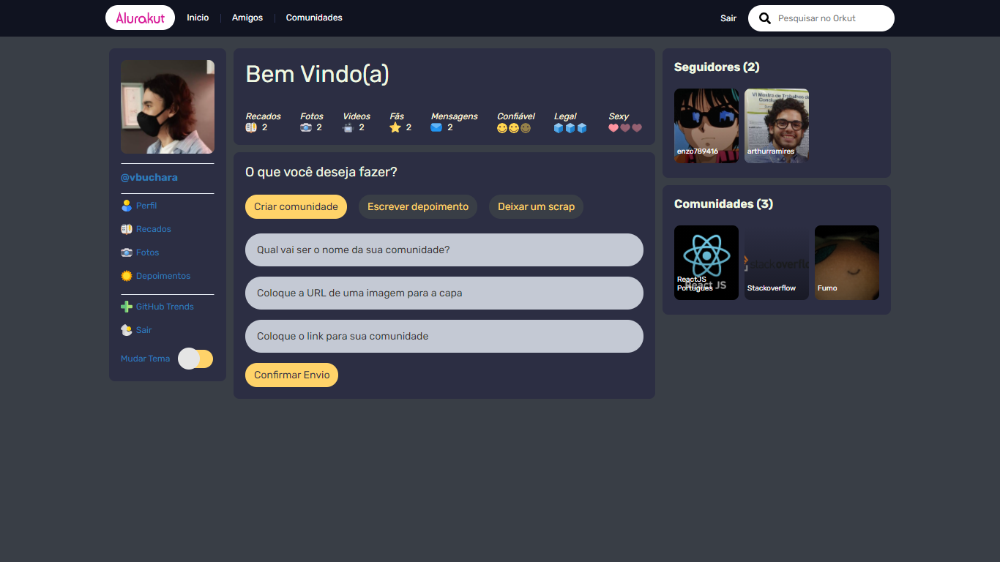

<h1 align="center">
	 Gitkut - A Orkut based Social Media   
	
	
	
</h1>

<h4  align="center">
	"Gitkut" is a social media totally based upon the former Orkut, developed using ReactJS and NextJS in the "Imersão React", a React learning event promoted by Alura.
</h4>

  
  

# ℹ️ Description

Gitkut is just like the old Orkut would be, it's a platform to share photos, videos and other contents to other people. Whether they are friends or participating in the same community, you can share all sort of contents and interact with all types of people and communities in this nostalgic social media 🌐 

This Application has been made during the "Imersão React 3a edição" event, with the help of Alura. The original aplication name was "Alurakut", I took my own personal changes and style through the development of Alurakut and have made the new application Gitkut ❗

# 📝Features and Changes (WIP)

- [x] Dark and Light Themes
- [ ] OAuth Github Login
- [ ] Community Page
- [ ] User Page
- [ ] Like/Fan System
- [ ] Trust/Cool/Sexy System
- [ ] Language Change System

# 👩‍💻 Technologies

This project was developed using ReactJS and NextJS, using libs like Styled-components, and integrated with DatoCMS for information storage. I also have used Typescript for this project.

	
| 📚 Frameworks and Libraries |
|--|
| ReactJS |
| NextJS |
|💅styled-components |
| DatoCMS |
	

# 📜 Scripts

This application has the standard scripts of a Create Next App. You can fork or clone it, and run with:

### `yarn dev` or `yarn start`

---

<h3 align="center">
Made with ♥️ by Vinicius Buchara
</h3>

	

	

